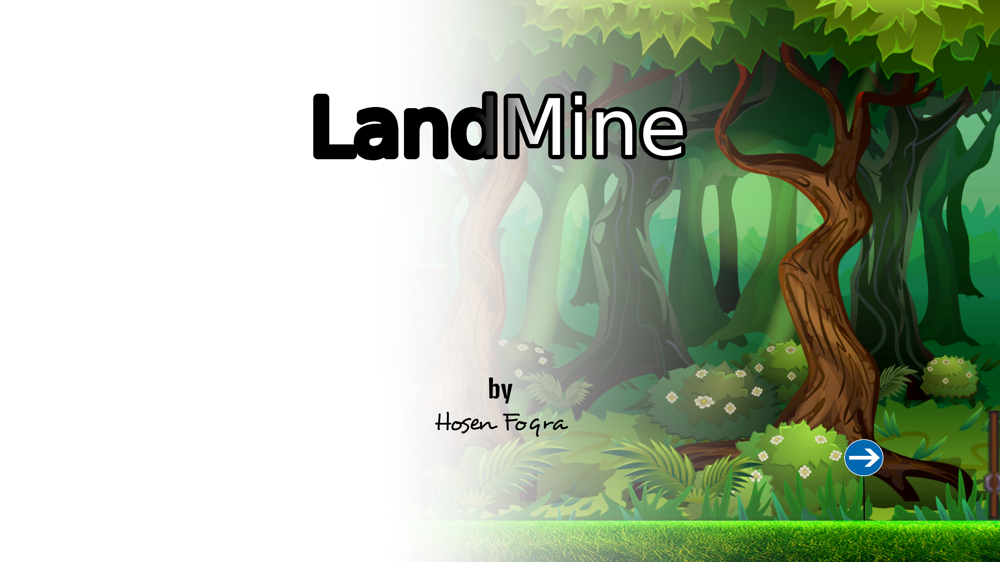
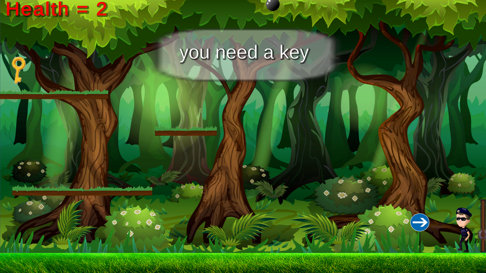
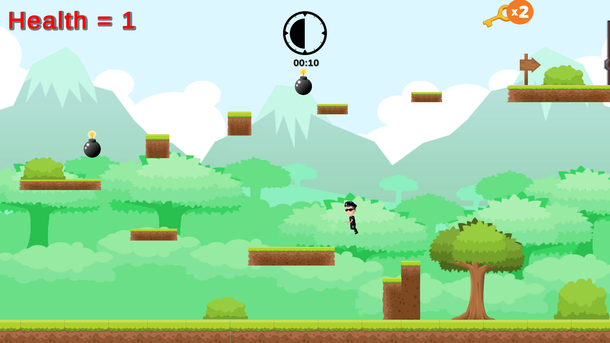

# [LandMine]

## 🎮 About the Game
**[LandMine]** is a 2D game developed using Unity. In this game, players will be need to escape from the falling mines, players have 3 hearts, and the player needs to get a key and escape to the door.

Enjoy challenging levels, smooth mechanics, and immersive gameplay designed for all ages!

## 🕹️ Features
- ["Unique 2D art style."]
- ["Exciting challenges and levels."]
- ["Smooth and responsive controls."]

## 📸 Screenshots
Here are some glimpses of the game:
- 
- 
- 

## 🎯 How to Play
1. ["Use the arrow keys to move , Space bar to jump ."]
2. ["Avoid obstacles and collect keys."]
3. ["Reach the door to complete the level."]

## 🎮 the game

  Play it here: [LandMine Game](https://hosenfoqra.github.io/LandMineGame/)
   
## 🛠️ About the Repository
This repository contains:
- **WebGLBuild/**: The playable WebGL version of the game.
